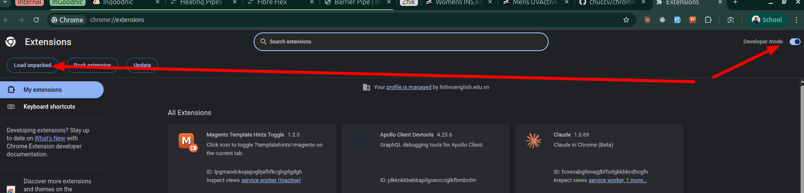
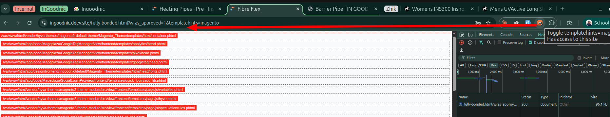

# Magento Template Hints Toggle

Chrome extension (Manifest V3) bật/tắt nhanh tham số `?templatehints=magento` trên tab hiện tại — dùng để debug template path của Magento 2 / Hyvä mà không cần vào admin bật Template Path Hints.

Một click = toggle: nếu URL chưa có param thì thêm vào, có rồi thì xoá. Tab tự reload với URL mới.

## Quick install (script all-in-one)

```bash
git clone git@github.com:chuccv/chrome-templatehints-ext.git
cd chrome-templatehints-ext
./install.sh           # clone (nếu cần) + mở chrome://extensions, bạn click Load unpacked
./install.sh --launch  # khởi chạy Chrome với --load-extension, extension load sẵn
./install.sh --help    # xem các flag khác
```

Script tự tìm `google-chrome` / `chromium` / `brave-browser` trong PATH. Nếu không có, sẽ in hướng dẫn cài thủ công.

## Cài đặt thủ công

1. Mở Chrome, vào `chrome://extensions`
2. Bật **Developer mode** (góc phải trên)
3. Click **Load unpacked** rồi chọn thư mục chứa extension này



4. Ghim icon lên toolbar: click icon 🧩 (Extensions) → đinh ghim 📌 cạnh **Magento Template Hints Toggle**

## Sử dụng

Mở 1 trang Magento bất kỳ → click icon extension trên toolbar.

Tab sẽ reload với `?templatehints=magento` được append (hoặc bỏ ra nếu đang có), và bạn sẽ thấy đường dẫn template `.phtml` của các block hiện ra trên trang.



Click lại lần nữa để tắt.

## Files

- `manifest.json` — khai báo MV3, action không có popup
- `background.js` — service worker lắng nghe `chrome.action.onClicked`, toggle param qua `URL` API
- `icon16.png` / `icon32.png` / `icon48.png` / `icon128.png` — bộ icon đa kích thước
- `make_icon.py` — script Pillow để generate icon (sửa màu/chữ rồi `python3 make_icon.py`)

## Permissions

- `activeTab` — đọc URL của tab khi user click icon
- `tabs` — gọi `chrome.tabs.update` để reload tab với URL mới

Không gửi dữ liệu ra ngoài, không content script, không storage.

## Customize giá trị param

Mặc định toggle `templatehints=magento`. Sửa trong `background.js`:

```js
const PARAM = "templatehints";
const VALUE = "magento"; // đổi thành "blocks", "all"... tuỳ nhu cầu debug
```

Sau khi sửa: vào `chrome://extensions` → click 🔄 **Reload** trên card extension.
